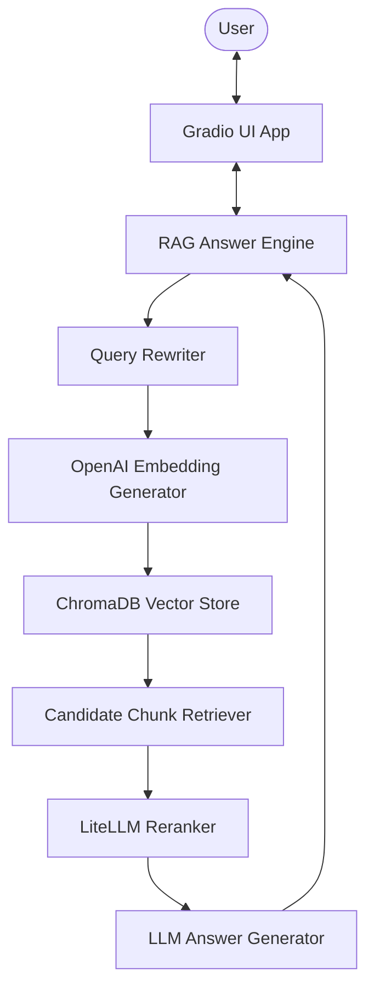
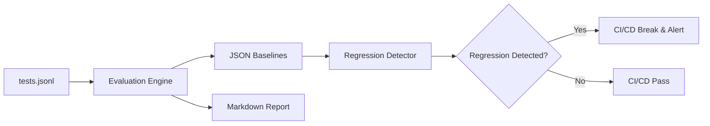

# Insurellm RAG System and Evaluation Harness

The Insurellm RAG System is a production-grade, business-oriented retrieval-augmented generation (RAG) platform tailored for insurance contract and policy consultation. Beyond providing high-accuracy answers, this repository implements a comprehensive Evaluation Harness and regression testing suite to enforce quality metrics at every prompt or code change.

---

## Technical Architecture

The system utilizes a dual-query retrieval strategy, semantic reranking, and a dedicated model hierarchy to optimize both retrieval quality and response generation cost.



---

## Core Features

*   **Refined Search Intent**: Automatically rewrites incoming conversational queries into focused keyword searches to maximize recall from the vector database.
*   **Dual-Query Retrieval**: Executes parallel queries for both the rewritten search term and the original question, merging and deduplicating chunks.
*   **Semantic Reranking**: Utilizes a lightweight utility model to rerank candidate passages, selecting only the top relevant chunks for final context window assembly.
*   **Hierarchical Model Configuration**: Decouples model definitions by task requirements to balance speed, cost, and accuracy (Utility vs. Generation vs. Judge).
*   **Production Quality Harness**: Integrates automated evaluation metrics and a regression detection pipeline to protect the codebase from silent performance drops.

---

## Quality Assurance and Evaluation Harness

To measure RAG output quality objectively, this repository implements an end-to-end evaluation pipeline that runs locally and integrates into CI/CD workflows.



### 1. Evaluation Metrics
*   **Retrieval Metrics**: 
    *   *Mean Reciprocal Rank (MRR)*: Evaluates the rank positioning of the first relevant document.
    *   *Normalized Discounted Cumulative Gain (nDCG)*: Evaluates the retrieval order and ranking quality.
    *   *Keyword Coverage*: Measures the percentage of golden keywords captured in the top context passages.
*   **Generation Metrics (LLM-as-a-Judge)**:
    *   Uses Pydantic structured outputs to evaluate generated answers across three dimensions (Accuracy, Completeness, and Relevance) on a 1-5 scale.

### 2. Regression Testing with Critical Case Subset
Evaluating the full suite of 150 test questions on every commit is computationally and financially expensive. To solve this, the regression test suite operates on a subset of 7 representative questions (`CRITICAL_CASE_INDICES = [0, 65, 80, 90, 95, 100, 140]`) covering all major question categories:
*   `direct_fact`
*   `temporal`
*   `comparative`
*   `numerical`
*   `relationship`
*   `spanning`
*   `holistic`

The regression engine compares the current subset run against the baseline snapshot. If any core metric drops by more than the configured threshold (default `5%`), the build fails.

---

## Quick Start

### Prerequisites
*   Python >= 3.11
*   `uv` package manager installed

### 1. Environment Setup
Create a `.env` file in the root directory and configure your credentials:
```bash
OPENAI_API_KEY=your_openai_api_key_here
DB_NAME=preprocessed_db
COLLECTION_NAME=docs
```

### 2. Install Dependencies
Synchronize virtual environment and install dependencies:
```bash
uv sync --all-extras --dev
```

### 3. Run Vector Database Ingestion
Load documents from the knowledge base and construct the vector store database:
```bash
uv run python utils/ingest.py
```

### 4. Run the Gradio Applications
Launch the main user assistant interface:
```bash
uv run python app.py
```
Or launch the evaluation dashboard UI:
```bash
uv run python evaluator.py
```

### 5. Execute Tests and Regression Suite
*   Run the fast unit test suite:
    ```bash
    uv run pytest -m "not integration"
    ```
*   Run the prompt regression test suite:
    ```bash
    uv run pytest -k test_prompt_regression
    ```

---

## Architecture Decision Records (ADRs)

To understand key engineering trade-offs regarding evaluation design, model configuration, and regression strategies, refer to the following records:
*   [ADR-001: Evaluation Metrics Selection](file:///d:/programming/Udemy/LLM_8weeks/RAG_impl/docs/adr/adr-001-evaluation-metrics.md)
*   [ADR-002: Model Tier Hierarchy](file:///d:/programming/Udemy/LLM_8weeks/RAG_impl/docs/adr/adr-002-model-hierarchy.md)
*   [ADR-003: Regression Testing and Gatekeeping Strategy](file:///d:/programming/Udemy/LLM_8weeks/RAG_impl/docs/adr/adr-003-regression-testing.md)

---

## System Limitations and Future Roadmap

### Limitations
*   **API Dependency**: The system relies on OpenAI and third-party API keys for embeddings, completion, and evaluation.
*   **Cold Start Database Ingest**: Massive directory ingestion is single-node bound. Scaling ingestion to distributed workers would be required for large datasets.

### Roadmap
*   **Semantic Caching**: Add a Redis-based semantic cache to skip retrieval and generation steps for identical or highly similar queries, optimizing user latency and API cost.
*   **Local Models Support**: Integrate Ollama/vLLM endpoints for localized embeddings and generation to support strict on-premise data governance.
