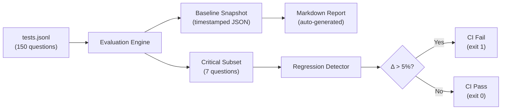

# Insurellm RAG System — Enterprise Knowledge QA with Evaluation Harness

A production-grade Retrieval-Augmented Generation (RAG) platform for insurance policy and company knowledge consultation. Built from the ground up **without LangChain abstractions**, the system implements AI-assisted semantic chunking, dual-query retrieval with LLM reranking, and a comprehensive **Evaluation-as-Code** harness with automated regression testing — all wired into a CI/CD pipeline.

> **Design philosophy**: Understand the underlying mechanisms, write every pipeline step explicitly, and prove quality with quantifiable metrics — not vibes.

---

## Technical Architecture

The system orchestrates four pipeline stages — **Ingest → Retrieve → Generate → Evaluate** — each backed by purpose-built modules rather than opaque framework wrappers.
For more details, please refer to the documents in the `docs/architecture` folder.


---

## Key Technical Decisions

### 1. AI-Assisted Semantic Chunking (vs. Fixed-Length Splitting)

Traditional `RecursiveCharacterTextSplitter` blindly cuts text by token count, breaking semantic coherence. Instead, we call a lightweight LLM (`gpt-4.1-nano`) to split each document into **semantically complete chunks**, each containing:
- `headline` — a searchable context title
- `summary` — a dense semantic anchor for embedding quality
- `original_text` — the verbatim source for answer grounding

This approach significantly improves retrieval precision at the cost of higher ingestion latency (mitigated by `multiprocessing.Pool` parallelism and `tenacity` retry with exponential backoff).

### 2. Dual-Query Retrieval + LLM Reranking

A single embedding query often misses relevant documents when user phrasing differs from document terminology. Our retrieval strategy:
1. **Rewrite** the user's conversational query into a focused search query using LLM
2. **Execute two parallel vector searches** (original + rewritten), each returning Top-K candidates
3. **Merge and deduplicate** the combined results
4. **Rerank** via LLM with Pydantic-enforced structured output (`RankOrder`), selecting the most relevant chunks

### 3. Decoupled Model Tier Hierarchy

Not every pipeline task needs the same model. We split LLM usage into three roles centralized in [`config.py`](config.py):

| Role | Model | Purpose |
|------|-------|---------|
| **Utility** | `gpt-4.1-nano` | Query rewriting, chunking, reranking — speed & cost optimized |
| **Generation** | `gpt-4.1-mini` | User-facing RAG answers — quality optimized |
| **Judge** | `gpt-4.1-mini` | LLM-as-a-Judge evaluation — credibility optimized |

All model constants are overridable via environment variables for easy experimentation. See [ADR-002](docs/adr/adr-002-model-hierarchy.md).

---

## Quality Assurance & Evaluation Harness

Quality is not subjective — it is measured, versioned, and gated.

### Evaluation Metrics

| Phase | Metric | What It Measures |
|-------|--------|------------------|
| **Retrieval** | Mean Reciprocal Rank (MRR) | Rank position of the first relevant document |
| **Retrieval** | Normalized Discounted Cumulative Gain (nDCG) | Overall ranking quality |
| **Retrieval** | Keyword Coverage | Percentage of golden keywords captured in context |
| **Generation** | Accuracy (1-5) | Factual correctness vs. gold standard |
| **Generation** | Completeness (1-5) | Whether all parts of the question are addressed |
| **Generation** | Relevance (1-5) | Whether the answer is focused and free of irrelevant content |

Generation metrics use an **LLM-as-a-Judge** pattern with Pydantic structured outputs to ensure parseable, multi-dimensional scoring. See [ADR-001](docs/adr/adr-001-evaluation-metrics.md).

### Regression Testing Pipeline

Evaluating all 150 test questions on every commit is expensive. Instead, we use a **stratified critical-case subset** of 7 representative questions spanning all categories (`direct_fact`, `temporal`, `comparative`, `numerical`, `relationship`, `spanning`, `holistic`).



Three CLI actions drive the workflow:
- **`run`** — Execute evaluation and print summary (exploratory)
- **`save`** — Execute, snapshot to JSON, and auto-generate Markdown report
- **`compare`** — Run critical subset, compare against latest baseline, fail on regression

See [ADR-003](docs/adr/adr-003-regression-testing.md).

### CI/CD Integration

GitHub Actions runs the fast unit test suite on every push/PR. Integration regression tests (requiring API keys) are gated behind `@pytest.mark.integration` for local or secure CI execution.

---

## Project Structure

```
.
├── app.py                     # Gradio Chat UI entry point
├── evaluator.py               # Gradio Evaluation Dashboard UI
├── config.py                  # Centralized model & DB configuration
├── utils/
│   ├── answer.py              # RAG core: rewrite → retrieve → rerank → generate
│   └── ingest.py              # ETL: fetch → LLM chunk → embed → store
├── evaluation/
│   ├── eval.py                # Retrieval & generation metric calculators
│   ├── baseline.py            # Baseline snapshot, regression detection CLI
│   ├── report.py              # Auto-generate Markdown evaluation reports
│   ├── test.py                # Pydantic data model for test questions
│   └── tests.jsonl            # 150-question evaluation dataset
├── tests/
│   ├── test_eval_metrics.py   # Unit tests: MRR, DCG, nDCG calculations
│   ├── test_answer_utils.py   # Unit tests: merge_chunks logic
│   └── test_prompt_regression.py  # Integration: critical-case regression gate
├── knowledge-base/            # Source documents (company, contracts, employees, products)
├── preprocessed_db/           # ChromaDB persistent vector store
├── docs/
│   ├── adr/                   # Architecture Decision Records (ADR-001 ~ 003)
│   ├── architecture/          # Module-level architecture overviews
│   └── evaluation_result/     # Timestamped evaluation reports (auto-generated by `baseline.py save`)
└── .github/workflows/test.yml # CI pipeline (pytest on push/PR)
```

---

## Quick Start

### Prerequisites
- Python ≥ 3.11
- [`uv`](https://docs.astral.sh/uv/) package manager

### 1. Clone & Configure
```bash
git clone https://github.com/teddy7x7/company-rag.git
cd company-rag
cp .env.example .env
# Edit .env and add your OPENAI_API_KEY (required)
```

### 2. Install Dependencies
```bash
uv sync --all-extras --dev
```

### 3. Build the Vector Store
```bash
uv run python utils/ingest.py
```

### 4. Launch the Chat UI
```bash
uv run python app.py
```
Or launch the Evaluation Dashboard:
```bash
uv run python evaluator.py
```

### 5. Run Tests
```bash
# Fast unit tests (no API keys needed)
uv run pytest -m "not integration"

# Prompt regression test (requires API keys + baseline snapshot)
uv run pytest -k test_prompt_regression
```

### 6. Manage Evaluation Baselines
```bash
# Run full evaluation, save a baseline snapshot, and auto-generate a timestamped report
# Snapshot filename: evaluation/baselines/{timestamp}_{label}.json  (label is optional)
uv run python evaluation/baseline.py save --label "v1_baseline"

# [Fast] Save a subset-only snapshot (7 critical cases, ~95% fewer tokens)
uv run python evaluation/baseline.py save --subset --label "v2_subset_check"

# Compare latest live run against latest saved baseline
uv run python evaluation/baseline.py compare

# [Fast] Compare only critical-case subset against the latest baseline
uv run python evaluation/baseline.py compare --subset

# [Offline] Compare two existing snapshots directly — no API calls, no cost
# Note: Pass .json snapshot files from evaluation/baselines/, NOT the rendered .md reports!
uv run python evaluation/baseline.py compare \
    --baseline evaluation/baselines/20260709_175414.json \
    --current  evaluation/baselines/20260714_122443.json

# [Offline] Compare a subset snapshot against a full baseline snapshot (requires --subset flag)
uv run python evaluation/baseline.py compare \
    --baseline evaluation/baselines/20260715_134048_v3_subset_check.json \
    --current  evaluation/baselines/20260715_143829_v3_baseline.json \
    --subset

# [Optional] Retroactively generate a report from the latest snapshot
uv run python evaluation/report.py

# [Optional] Or specify an older snapshot and a custom output path
uv run python evaluation/report.py evaluation/baselines/20260713_172437_v1_baseline.json --output docs/evaluation_result/evaluation-report-20260713_172437.md
```

---

## Architecture Decision Records

| ADR | Decision |
|-----|----------|
| [ADR-001](docs/adr/adr-001-evaluation-metrics.md) | Evaluation Metrics Selection — MRR + nDCG + LLM-as-a-Judge over BLEU/ROUGE |
| [ADR-002](docs/adr/adr-002-model-hierarchy.md) | Decoupled Model Tier Hierarchy — Utility vs. Generation vs. Judge |
| [ADR-003](docs/adr/adr-003-regression-testing.md) | Regression Testing Strategy — Critical-case subset gating for CI |
| [ADR-004](docs/adr/adr-004-framework-free-architecture.md) | Framework-free Vanilla RAG Architecture Selection — No-Framework Architecture |
| [ADR-005](docs/adr/adr-005-semantic-chunking.md) | AI-Assisted Semantic Chunking Strategy — Headline + Summary extraction |
| [ADR-006](docs/adr/adr-006-input-output-guardrails.md) | Dual-Guardrail Architecture — Input Intent Routing & Output Self-Reflection |

---

## Technical Refinement & Evaluation Harness
This system is a heavily optimized, enterprise-grade evolution of the RAG implementation originally from the [LLM Engineering Course (Week 5)](https://github.com/ed-donner/llm_engineering/tree/main/week5) by Ed Donner.

While the core dataset and fundamental step-by-step pipeline concepts stem from the original course, it has been systematically upgraded from a tutorial script into a **production-grade**, **engineering-disciplined RAG platform**. We built an automated Evaluation-as-Code infrastructure to eliminate regression risks and configuration drift without framework overhead.

### Key Milestones Achieved

- SSOT Configuration ([`config.py`](config.py)): Centralized model management with a decoupled model tier hierarchy (gpt-4.1-mini/nano).
- Rigorous Testing Suite ([`pytest`](https://docs.pytest.org/en/latest/)): 100% test coverage on core math operations (MRR, nDCG, DCG) and retrieval deduplication logic (merge_chunks).
- CI/CD Automation: Integrated with GitHub Actions and uv package manager for instant pipeline verification on every push/PR.
- Baseline Snapshots & Regression Gate: Implemented a CLI tool ([`baseline.py`](evaluation/baseline.py)) that captures JSON snapshots of system metrics and triggers a CI failure (exit code 1) if quality drops by >5%.
- Automated Markdown Reporting: Automated generation of [`docs/evaluation_result/evaluation-report-*.md`](docs/evaluation_result/) with weakness discovery for targeted optimization.
- Full Harness Observability (B-01): Extended baseline snapshots to persist LLM Judge `feedback` and `generated_answer` per test case. Failure analysis tables in evaluation reports now surface Judge reasoning inline, enabling root-cause tracing without re-running the pipeline.
- Prompt Regression Framework: Designed a stratified subset of 7 critical-case questions spanning all categories, enabling robust prompt regression testing at 95% less token cost.

### Want to Dive Deeper?
For the full implementation journey, architectural decisions, and optimization strategies over the original course repository, check out the [Stage 2 Refinement Records](docs/refine/stage2-refine-records.md) *(Currently written in Traditional Chinese)*.

To review unresolved edge cases, systemic bottlenecks, and the upcoming feature development pipeline, explore the [Stage 2.5 Refinement Backlog](docs/refine/stage2.5-backlog_c1.md) *(Currently written in Traditional Chinese)*.

---

## Known Limitations & Future Roadmap

### Limitations
- **API Dependency**: Requires OpenAI API keys for embeddings, generation, and evaluation. No offline mode.
- **Synchronous Execution Bottlenecks**: 
  - The retrieval pipeline executes sequential LLM/API calls (rewrite + 2 vector searches + rerank) rather than parallelizing independent I/O operations (see [B-10](docs/refine/stage2.5-backlog_c1.md#b-10)).
  - The evaluation harness executes RAG generation and LLM judging sequentially, causing high latency during full-dataset runs (see [B-11](docs/refine/stage2.5-backlog_c1.md#b-11)).
- **Input Guardrails & Noise Filtering**: The system does not classify user intent beforehand, leading to unnecessary vector searches for off-topic/casual inputs, and the retrieval lacks distance threshold filtering to discard low-relevance chunks (see [B-08](docs/refine/stage2.5-backlog_c1.md#b-08)).
- **Systematic Weaknesses on Spanning & Holistic Queries**: Evaluation reports identify drop-offs in performance (MRR < 0.70, Accuracy < 3.5/5) for multi-document reasoning (`spanning`) and aggregate calculation queries (`holistic`) compared to simple fact lookup (see [B-15](docs/refine/stage2.5-backlog_c1.md#b-15)).

### Roadmap
- **Production-Grade Input Guardrails (P1)**: Integrate a lightweight intent classifier to route inputs (casual talk, direct answers from history, RAG queries, or safety violations) and apply distance-threshold filtering on retrieved chunks (see [B-08](docs/refine/stage2.5-backlog_c1.md#b-08), [B-21](docs/refine/stage2.5-backlog_c1.md#b-21)).
- **Asynchronous Evaluation Harness (P1)**: Migrate the evaluation suite to `asyncio` and `litellm.acompletion()` with token-bucket semaphores to speed up benchmark runs by 10x (see [B-11](docs/refine/stage2.5-backlog_c1.md#b-11)).
- **Generative Self-Correction Loop (P2)**: Implement a reflection/critique step where the LLM evaluates its generated answer against retrieved context, triggering automatic query rewriting and supplementary vector search if details are incomplete (see [B-20](docs/refine/stage2.5-backlog_c1.md#b-20)).
- **Dynamic Stratified Sampling (P2)**: Transition the regression suite from hardcoded file indices to a dynamic, category-representative sampling logic that auto-validates category coverage (see [B-02](docs/refine/stage2.5-backlog_c1.md#b-02)).
- **Dual-Query Retrieval Parallelization (P3)**: Utilize thread pools to concurrently fetch vector embeddings for the original and rewritten queries (see [B-10](docs/refine/stage2.5-backlog_c1.md#b-10)).
- **Streaming Response support (P3)**: Enable token-streaming generator output in the RAG backend and wire it to Gradio for better interface interactivity (see [B-17](docs/refine/stage2.5-backlog_c1.md#b-17)).

### Future-Looking Enhancements
- **Semantic Caching**: Add a Redis-based semantic cache to skip retrieval and generation for near-duplicate queries.
- **Local Model Support**: Integrate Ollama/vLLM endpoints for on-premise deployments with strict data governance requirements.
- **Agentic Workflows**: Leverage LangGraph `StateGraph` for multi-step reasoning, Human-in-the-loop review, and tool-calling capabilities.