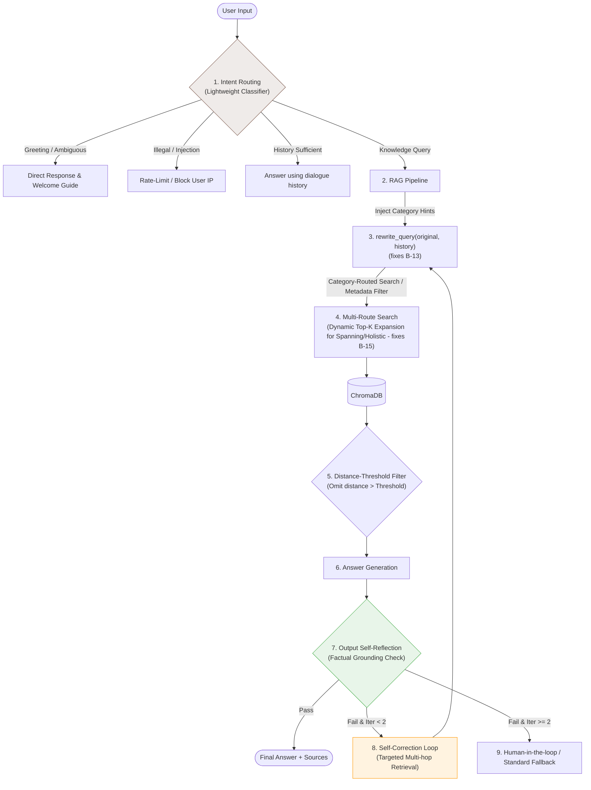

# ADR-006: Dual-Guardrail Architecture for RAG Input Filtering and Response Self-Reflection

## Status
Proposed (Targeted for Sprint 2)

## Context
As RAG systems transition to production environments, they face a severe quality and safety challenge:
1.  **Blind Retrieval**: The system executes the full RAG pipeline for all inputs. Off-topic greetings ("How's the weather?") or unsafe prompts trigger unnecessary vector database queries and LLM invocations, wasting API tokens and displaying irrelevant chunks in the UI. Furthermore, it exposes the system to injection attacks, where malicious prompts bypass early filters and directly manipulate the vector search or downstream LLM generation, leading to data leaks or corrupted outputs.
2.  **Lack of Co-reference Resolution**: Dialogue history (`history`) is currently omitted when invoking `rewrite_query` (B-13). As a result, subsequent queries like "What are its limitations?" (referring to a previously mentioned product) fail to fetch correct documents.
3.  **Spanning & Holistic Weaknesses**: The system struggles with multi-document reasoning (`spanning` queries, e.g., "Compare the deductible limit between Plan A and Plan B") and aggregate analysis (`holistic` queries, e.g., "List all products under category X"). These queries require fetching disjoint chunks across multiple files. Standard Top-K search often misses these, causing answer accuracy to drop to 1.0/5.0 (B-15).
4.  **No Post-Generation Verification**: Generated answers are returned to the user without validating whether they are factually grounded in the retrieved text, resulting in a lack of fallback safety. Critically, this absence of verification fails to detect whether the LLM has leaked unauthorized sensitive data or hallucinated restricted proprietary information in its response, creating a severe data exfiltration risk.

We need a systematic guardrail architecture that filters input noise, handles complex query categories dynamically, and performs post-generation self-correction.

## Alternatives Considered
1.  **No Guardrails (Direct Execution)**: Simple and fast but highly vulnerable to out-of-scope queries, terminology mismatch in multi-turn dialogues, and factual hallucination.
2.  **Static Keyword/Rule Filtering**: Low latency but brittle, failing to route complex semantic intents (like greeting vs. spanning queries) or detect sophisticated prompt injections.
3.  **Dynamic Dual-Stage Guardrails (Input Intent Routing & Dynamic Context Expansion + Output Reflection & Correction Loop) (Selected)**: Deploy an integrated defense layer at the front and back of the pipeline to route intents, dynamically adjust search parameters, and verify grounding quality before response delivery.

## Decision
We choose to implement a **Dual-Guardrail Architecture** in `answer.py`:

### 1. Input Guardrail: Intent Classification & Parameter Injection
*   **Intent Router**: A lightweight utility model categorizes incoming queries:
    *   `history_sufficient`: Directly answers the question using dialogue memory to minimize latency.
    *   `knowledge_query`: Enters the RAG pipeline. 
        *   **Multi-Label Domain Classifier**: The router simultaneously predicts which of the 4 knowledge domains (`company`, `contracts`, `employees`, `products`) the query belongs to.
        *   **Context Hint Injection**: The predicted domain labels, alongside the dialogue history (`history` - fixing B-13), are injected into the `rewrite_query()` prompt. This provides the rewriter with domain-specific terminology constraints, preventing term drift and improving pronoun resolution.
        *   **Category-Routed Vector Search (Metadata Filtering)**: All chunks in ChromaDB are tagged with their respective `doc_type` metadata. When performing vector queries, the system uses the predicted domain labels to inject metadata filter conditions (e.g., `where={"doc_type": predicted_domain}` or using `$or` operators if multiple domains match) into `collection.query()`. This dynamically narrows the retrieval space, eliminating term mismatch from unrelated folders and improving MRR/nDCG scores.
    *   `out_of_bound` / `greeting`: Responds with a polite welcome message and redirects to the 4 main insurance knowledge areas.
    *   `illegal`: Logs warnings and triggers IP-based rate limiting to prevent prompt injections.
*   **Mitigating Spanning & Holistic Queries (B-15)**: If the router identifies a query as `spanning` (comparisons) or `holistic` (aggregates):
    1.  **Hint Injection**: An intent tag is appended to the rewriting model, guiding it to generate multiple sub-queries.
    2.  **Dynamic Context Expansion**: The system dynamically doubles the retrieval parameter values (e.g., doubling `RETRIEVAL_K` and `FINAL_K`) to pull in wider chunks across different files.
*   **Distance-Threshold Filtering**: Chunks with vector distances exceeding a strict threshold are discarded immediately, preventing irrelevant snippets from cluttering the context window or rendering in the Gradio UI.

### 2. Output Guardrail: Self-Reflection & Self-Correction
*   **Grounding Verifier**: An LLM judge evaluates the draft answer against the retrieved chunks. For `spanning` and `holistic` categories, the verifier specifically checks if all compared entities or listing criteria are addressed.
*   **Self-Correction Loop**: If verification fails (e.g., plan comparison is missing Plan B details), the verifier generates a query focused on the missing attributes. The system executes a secondary targeted vector search (multi-hop retrieval), merges the new chunks into the active context, and regenerates the answer. This is capped at **2 iterations** to limit API cost and response latency.
*   **Fallback Grace**: If the loop fails twice, the system returns a friendly fallback message ("I have limited information regarding X, would you like to refine your question or contact support?") instead of hallucinating.

## Consequences
*   **Systemic Weakness Remediation (B-15)**: Dynamically scaling context size and injecting comparison/aggregation prompts resolves the core retrieval bottlenecks for spanning/holistic questions.
*   **Multi-Turn Dialogue Improvement (B-13)**: Propagating history into `rewrite_query` resolves pronoun reference errors ("What are *their* benefits?"), matching user expectations.
*   **Precision via Semantic Metadata Filters**: Implementing metadata filters based on routed domain classification prevents term collision and similarity noise from unrelated folders, dramatically increasing retrieval precision (MRR/nDCG).
*   **Resource & Noise Reduction**: Off-topic queries are intercepted at the boundary, saving token costs and keeping the UI context panel clean.
*   **Latency Trade-off**: An extra classifier call adds ~150-300ms overhead. If the self-correction loop fires, latency will double. This is mitigated by restricting self-correction to complex query categories and using the fast utility model (`gpt-4.1-nano`) for routing and checking.
