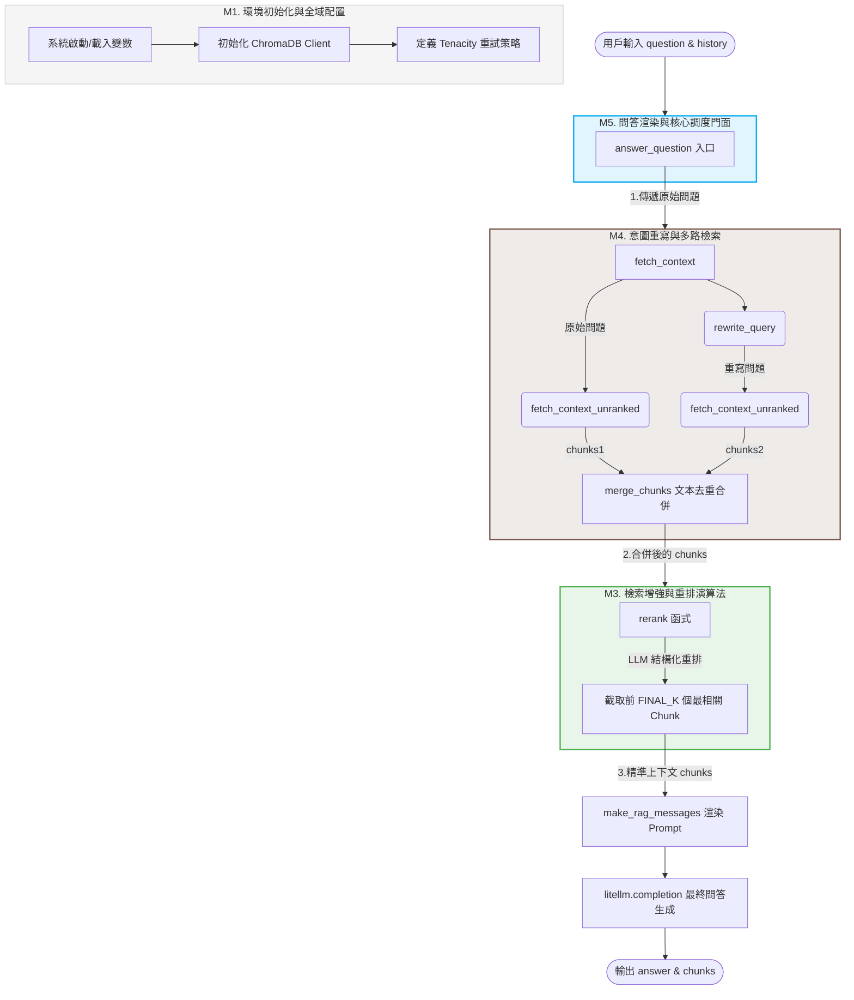

這是一份針對 `answer.py` 的全局架構與大綱分析。本文件將嚴格採用指定的結構進行模塊化拆解，作為後續逐模塊精讀與技術深挖的「地圖與大綱基準」。

## A. 整體定位

- **系統角色與依賴**：
    
    該檔案在整個 RAG（檢索增強生成）問答系統中扮演「核心調度與問答生成引擎」的角色。它負責處理從用戶輸入、查詢重寫（Query Rewriting）、向量檢索（Vector Retrieval）、上下文重排（Reranking）到最終大模型回答生成的全鏈路閉環。
    
    - **外部依賴**：`litellm`（多模型統一調用）、`chromadb`（向量資料庫）、`pydantic`（結構化輸出與資料校驗）、`tenacity`（彈性重試機制）、`openai`（純生成 Embedding 向量）。
        
- 小結：
    
    > 該腳本存在的理由是：**為保險問答場景提供具備「查詢優化、雙路檢索融合、LLM 重排與彈性容錯」的高準確度 RAG 生成方案。** 它解決了原生 RAG 檢索意圖不明確、向量檢索相關性不足以及分散式 LLM API 調用不穩定的核心痛點。
    

## B. 模塊劃分與建議閱讀順序

我們將 `answer.py` 依語意及職責劃分為以下 5 個主要模塊：

### M1. 環境初始化與全域配置

- **行號範圍**：1 - 37 行
    
- **一句話概要**：配置偵錯日誌、載入環境變數、初始化 ChromaDB 持久化客戶端與重試策略。
    
- **預估難度與技術稀缺度**：入門 (Easy) | 稀缺度：低（標準工程基建）
    
- **核心資料結構**：`chromadb.PersistentClient`
    
- **關鍵知識點**：`litellm` 日誌層級覆蓋、`tenacity.wait_exponential` 指數退避演算法。
    
- **工程實踐 / 效能瓶頸**：ChromaDB 的 `PersistentClient` 採用檔案鎖定，在多執行緒環境下可能遭遇併發讀寫瓶頸。
    

### M2. 結構化資料定義 (Data Contracts)

- **行號範圍**：40 - 48 行
    
- **一句話概要**：利用 Pydantic 定義檢索結果結構與大模型 Rerank 的 JSON Schema 輸出規範。
    
- **預估難度與技術稀缺度**：入門 (Easy) | 稀缺度：中（AI Engineer 必須精通的 Function Calling / Structured Output 基礎）
    
- **核心資料結構**：`Result(BaseModel)`, `RankOrder(BaseModel)`
    
- **關鍵知識點**：Pydantic `Field` 描述、LLM 結構化輸出引導（Structured Outputs）。
    
- **工程實踐 / 效能瓶頸**：`RankOrder` 的 Pydantic 驗證嚴格依賴 LLM 回傳正確的 JSON，若 LLM 幻覺回傳不符型別的資料，會觸發解析異常，需有強大的異常處理（此處依賴 M3 的重試）。
    

### M3. 檢索增強與重排演算法 (Retrieval & Reranking)

- **行號範圍**：51 - 72 行，以及 132 行
    
- **一句話概要**：實現 LLM-based Rerank 機制，並提供去重的文本塊合併（Merge）演算法。
    
- **預估難度與技術稀缺度**：硬核 (Hard) | 稀缺度：高（在求職市場上，懂得自主用輕量模型做 Reranker 最佳化、不盲目依賴商用 Rerank API 是進階代碼的指標）
    
- **核心資料結構**：`RankOrder.model_validate_json(reply).order`, List List-Comprehension
    
- **關鍵知識點**：LLM 評分/重排 Prompt 工程、In-context Reranking、Pydantic 嚴格 JSON 逆序列化。
    
- **工程實踐 / 效能瓶頸**：對所有 Chunk 進行字串遍歷去重（`merge_chunks` 複雜度 $O(N \times M)$，當 Chunk 數量極大時有最佳化空間），且 `rerank` 函式多消耗了一次 LLM 同步調用，是整體端到端延遲（Latency）的核心瓶頸。
    

### M4. 意圖重寫與多路檢索 (Query Rewriting & Vector Fetch)

- **行號範圍**：87 - 105 行，以及 127 - 132 行
    
- **一句話概要**：結合歷史對話重寫用戶當前問題，並實施「原問題 + 重寫問題」的雙路向量檢索融合。
    
- **預估難度與技術稀缺度**：進階 (Medium) | 稀缺度：中高（多路檢索與 Query 重寫是解決 RAG 幻覺與漏檢的業界標準手段）
    
- **核心資料結構**：`openai.embeddings.create` 向量數組、ChromaDB 查詢結果字典
    
- **關鍵知識點**：Query Rewrite（查詢重寫）消除指代不明、向量空間相似度檢索（Vector Search）、多路檢索融合（Reciprocal Rank Fusion 的變形）。
    
- **工程實踐 / 效能瓶頸**：`fetch_context` 內部串行調用了兩次 `fetch_context_unranked` 與一次 `rewrite_query`，造成高達 3 次網路 I/O 阻塞，可改為 `asyncio` 併發發送以大幅降低時間。
    

### M5. 問答渲染與核心調度門面 (Orchestration Facade)

- **行號範圍**：75 - 84 行，以及 135 - 143 行
    
- **一句話概要**：組裝問答的 Prompt 模板，並作為對外唯一的門面函式（Facade）輸出最終答案與參考上下文。
    
- **預估難度與技術稀缺度**：進階 (Medium) | 稀缺度：中（核心狀態機調度能力）
    
- **核心資料結構**：Chat Completion Messages 列表
    
- **關鍵知識點**：System Prompt 設計原則（限制邊界、防幻覺）、門面設計模式（Facade Pattern）。
    
- **工程實踐 / 效能瓶頸**：最終問答未採用串流（Streaming）輸出，這會導致用戶端前端在等待全鏈路完成時，面臨數秒的白屏（體驗較差）。
    

### 建議精讀順序

資深工程師在剖析此檔案時，會採取「由表及裡、主線優先、依賴後看」的逆向鏈路順序：

1. **M5 (核心調度門面)**：先讀入口 `answer_question`。抓出 RAG 的骨架（檢索 -> 組裝 -> 生成），理解這個檔案對外暴露的 API 與最上層數據流。
    
2. **M4 (意圖重寫與多路檢索)**：進入 `fetch_context` 主線，理解它如何透過 `rewrite_query` 優化意圖，並如何從資料庫撈取原始資料。
    
3. **M3 (檢索增強與重排演算法)**：當看到資料撈出來後，看它如何用 `rerank` 對資料進行二次清洗與精準排序，這是提升 RAG 準確度的關鍵演算法。
    
4. **M2 (結構化資料定義)**：回頭看 `Result` 與 `RankOrder` 的 Pydantic 定義，以此回推並驗證 M3 和 M4 中資料傳遞與解析的正確性。
    
5. **M1 (環境初始化與全域配置)**：最後掃一眼全域配置與重試機制，理解工程魯棒性（Robustness）的底層配置即可。
    

## C. 整體流程圖 (巨觀地圖)

下圖嚴格對應 B 段的模塊編號（M1-M5），展示一次問答請求的巨觀執行生命週期與資料流向：

程式碼片段

_關於函式呼叫關係的特別說明_：本腳本的呼叫關係為標準的單向拓撲線性向下（`answer_question` $\rightarrow$ `fetch_context` $\rightarrow$ `rewrite_query` / `fetch_context_unranked` $\rightarrow$ `rerank`），呼叫鏈深度恰好為 3 層，且無遞迴或多模塊交叉複用，因此不額外繪製複雜的呼叫關係圖，以上圖的資料流向圖已足夠巨觀掌握。

## D. 商業場景落地與工程價值

本架構（`answer.py`）的設計核心，是為了解決真實企業級 RAG（檢索增強生成）系統在生產環境落地時的常見痛點。以下為本模塊的設計背景與核心技術亮點總結：

### 1. 真實場景痛點與解決方案
在常見的線上保險問答（如此專案 Insurellm）等企業級場景中，原生 RAG 系統通常面臨兩大挑戰：
* **意圖模糊與漏檢**：用戶常輸入「那這款商品的理賠限制呢？」等帶有指代、缺乏上下文的問題。本架構透過 **M4 模塊的對話歷史重寫** 與 **雙路向量檢索融合**，確保了關鍵上下文的召回率（Recall）。
* **模型幻覺與排序不佳**：傳統向量檢索相關性不足。本架構在 **M3 模塊引入輕量級 LLM 作為 In-context Reranker**，搭配 **Pydantic 強制結構化 JSON 輸出**，對文本塊進行精準洗牌與截斷。
* **API 穩定性問題**：外部 LLM API 時常遭遇限流（Rate Limit）或網路波動。本架構在 **M1 模塊全鏈路覆蓋 Tenacity 指數退避重試機制**，將網路波動導致的請求失敗率降至最低。

### 2. 核心技術亮點 (Key Highlights)
* **進階 RAG 調度引擎設計**：基於 `LiteLLM` 與 `ChromaDB` 實現，完整涵蓋 Query Rewriting（查詢重寫）、多路檢索融合、以及 LLM-based Reranker，有效解決長尾意圖不明確與 RAG 幻覺問題。
* **工程魯棒性（Robustness）最佳化**：利用 Pydantic Structured Outputs 確保 Rerank 數據合約（Data Contracts）的嚴謹度；並整合 `Tenacity` 彈性重試機制，具備極高的自癒能力，顯著提升生產環境問答服務的可用性（Availability）。

---

後續不論想針對哪一個模塊（例如 **M3** 的 Rerank 提示詞技巧，或 **M4** 的雙路檢索設計）進行代碼逐行精讀與重構最佳化，我們都將以此編號與坐標系統為基準向前推進。