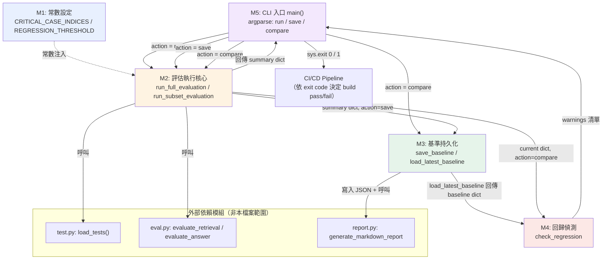

# baseline.py 全局分析大綱文件

> 本文件為 Insurellm RAG 評估 pipeline 的**基準參考大綱**，後續逐模塊精讀時可直接引用「M1」「M2」...等編號。線號為依原始碼手動計數之估算值，若與實際檔案有出入請以實際行號為準。

---

## A. 整體定位

**依賴的外部模組：**
- `evaluation.test`（`load_tests`）— 讀取 `tests.jsonl` 產出 `TestQuestion` 物件
- `evaluation.eval`（`evaluate_retrieval`, `evaluate_answer`）— 核心評估邏輯（檢索指標 + LLM-as-judge）
- `evaluation.report`（`generate_markdown_report`）— 產出人類可讀的 Markdown 報告
- `config`（`UTILITY_MODEL`, `GENERATION_MODEL`, `JUDGE_MODEL`）— 模型設定

**角色定位：** baseline.py 是整個 evaluation 套件的**編排層（Orchestration Layer）／CLI 入口**，它自己不做任何檢索或 LLM 評分的實作細節，而是負責「跑評估 → 存快照 → 讀舊快照 → 比較 → 判斷是否 regression → 決定 exit code」這條完整流程線。

**小結：**
> 讓 RAG 系統的每一次修改（prompt、retrieval 參數、換模型）都能被自動、量化、可重現地與歷史基準比較，把「LLM 系統品質驗證」變成可以掛進 CI/CD 的迴歸測試 gate，而不是靠人工肉眼抽查。

---

## B. 模塊劃分與建議閱讀順序

### M1. 環境設置與常數定義
- **行號範圍：** 1–20
- **概要：** import、`sys.path` 手動注入專案根目錄以支援獨立執行、定義 `BASELINE_DIR`、`REGRESSION_THRESHOLD`、`CRITICAL_CASE_INDICES`
- **難度：** 入門　|　**稀缺度：** 低
- **核心資料結構：** `Path`、`list[int]`、`float` 常數
- **關鍵知識點：**
  - `sys.path.append(str(Path(__file__).parent.parent))` 是讓腳本既能被當 module import、又能被 `python baseline.py` 直接執行的常見 workaround
  - `CRITICAL_CASE_INDICES = [0, 65, 80, 90, 95, 100, 140]` 是一種**分層抽樣（stratified sampling）**的雛形——用少量代表性樣本近似整體品質，以節省 LLM API 成本
- **工程實踐 / 瓶頸：** 這組硬編碼 index 高度依賴 `tests.jsonl` 的順序與內容不變；若測試集重新排序或增刪，這組「代表各類別」的假設會悄悄失效且沒有任何驗證機制去偵測。

---

### M2. 評估執行核心
- **行號範圍：** 22–153（`run_subset_evaluation` 22–63；`run_full_evaluation` 65–153）
- **概要：** 對測試集（全量或子集）逐筆呼叫 `evaluate_retrieval` / `evaluate_answer`，並累加計算平均指標；`run_full_evaluation` 額外在同一迴圈內「順便」累計 critical case 子集平均值
- **難度：** 進階　|　**稀缺度：** 中（Eval Harness 設計是 AI engineer 求職市場上愈來愈被重視的能力，但寫法本身不算稀有技術）
- **核心資料結構：**
  - `RetrievalEval` / `AnswerEval`（外部 pydantic model，決定了這裡累加哪些欄位）
  - 累加器變數群（`total_mrr`, `sub_mrr`...）—— 一種手寫的 running-sum pattern
  - `results: list[dict]` 逐筆明細 + 最終 `summary: dict`
- **關鍵知識點：**
  - `run_full_evaluation` 用 `if idx in CRITICAL_CASE_INDICES` 在跑全量評估的**同一次迴圈**裡順便算出 critical subset 的平均值，避免對 critical cases 重複呼叫 LLM——這是一個值得注意的效能設計巧思
  - 但 `run_subset_evaluation` 和 `run_full_evaluation` 有大量重複邏輯（累加六個指標、印 log 的模式幾乎一樣），是明顯的 **DRY 違反**，值得在精讀時討論如何重構（例如抽出共用的 `_accumulate(ret_eval, ans_eval, acc_dict)` helper）
- **工程實踐 / 瓶頸：**
  - **同步序列迴圈呼叫 LLM**：`evaluate_answer` 內部呼叫 `completion()`（見 eval.py 的 TODO 註解已承認），沒有 batching/async，是整個 pipeline 最大的延遲瓶頸（n 筆測試 = n 次序列阻塞 LLM 呼叫）
  - **沒有任何逐筆錯誤處理（try/except）**：若第 50 筆測試因為 LLM API 超時或 JSON parse 失敗而丟例外，整個 300+ 筆的評估會直接中斷，前面已花費的 API 成本全部浪費
  - `total_tests == 0` 的邊界檢查有做，但「LLM 呼叫失敗」這種更常見的失敗模式完全沒有防護

---

### M3. 基準快照持久化
- **行號範圍：** 155–186（`save_baseline` 155–173；`load_latest_baseline` 175–186）
- **概要：** 將評估結果以時間戳記命名寫成 JSON 檔（並順便觸發 Markdown 報告生成），以及讀取「最新」一份基準快照
- **難度：** 入門/進階　|　**稀缺度：** 低-中
- **核心資料結構：** JSON 檔案（`BASELINE_DIR/*.json`）、`Path.glob` 排序後的檔名列表
- **關鍵知識點：**
  - 用 `YYYYMMDD_HHMMSS` 格式的時間戳當檔名，使得**字典序排序＝時間序排序**，這是一個常見但值得留意的小技巧（`sorted(...)[-1]` 直接拿到最新檔案）
  - `save_baseline` 內用 `try/except` 包住 `generate_markdown_report`，體現了「非關鍵副作用不應該讓主流程失敗」的設計原則（報告產生失敗不影響 baseline 已存檔的事實）
- **工程實踐 / 瓶頸：**
  - 檔案式版本控管沒有任何清理/保留策略（retention policy），baseline 資料夾會無限增長
  - 沒有並發寫入保護——如果 CI 上有兩個 job 同時跑 `save`，理論上不會衝突（因為時間戳夠精細），但完全依賴這個假設沒有明確保證或加鎖
  - `load_latest_baseline` 對檔名格式沒有做結構化驗證，若資料夾裡混入非期望格式的 `.json`，`sorted()` 的字典序假設可能失準

---

### M4. 回歸偵測邏輯
- **行號範圍：** 188–212
- **概要：** 比較 current 與 baseline 兩個 summary dict 在六項指標上的差值，超過閾值就產生警告字串
- **難度：** 入門　|　**稀缺度：** 中（threshold-based regression detection 的思路直接對應到生產環境的 model drift monitoring，值得在履歷/面試中強調這個類比）
- **核心資料結構：** `metrics_to_check: dict[str, str]`（指標名 → 顯示標籤）、`warnings: list[str]`
- **關鍵知識點：**
  - 對 `avg_coverage`（0–100 尺度）特別把閾值乘以 100，其餘指標維持 0.05—— 即「不同指標尺度不同，不能用同一個絕對閾值」
  - **但這個處理並不完整**：`avg_accuracy` / `avg_completeness` / `avg_relevance` 是 1–5 分尺度，`avg_mrr` / `avg_ndcg` 是 0–1 尺度，兩者用同一個 `REGRESSION_THRESHOLD = 0.05` 做絕對值比較，意味著「LLM 評分掉 0.05 分（滿分5分中的1%）」跟「MRR 掉 0.05（滿分1中的5%）」被視為同等嚴重程度的 regression，這是一個很適合在精讀時深入討論的設計爭議點
- **工程實踐 / 瓶頸：** 固定絕對閾值沒有考慮 LLM judge 本身的評分變異度（同一個答案讓 LLM 評兩次分數可能就有 ±0.3 的抖動），容易因為抽樣/評分雜訊而誤判 regression，較嚴謹的做法會需要統計顯著性檢定或多次重跑取信賴區間。

---

### M5. CLI 入口與流程調度
- **行號範圍：** 214–273
- **概要：** `argparse` 定義 `run` / `save` / `compare` 三種動作，依動作分派呼叫 M2～M4 的函式，並用 `sys.exit(1)` 讓 regression 或缺少 baseline 的情況能被外部 CI 系統偵測
- **難度：** 入門　|　**稀缺度：** 低（但 exit code gate 的用法是重要的 CI/CD 整合細節）
- **核心資料結構：** `argparse.Namespace`
- **關鍵知識點：**
  - `sys.exit(1)` 出現在三個地方：缺少 baseline、`current` 為 None、偵測到 regression——這是把 Python 腳本變成「CI Gate」的關鍵手法（GitHub Actions 等系統靠 exit code 判斷 job 是否 pass）
  - 三個 action 對應三種真實使用情境：`run`＝本地探索性檢查、`save`＝建立新基準（通常在確認品質提升後手動執行）、`compare`＝PR/CI 自動迴歸檢查
- **工程實踐 / 瓶頸：** 所有輸出都是 `print()`，屬於人類可讀但非結構化的格式；若未來要把 regression 結果推播到 Slack/建立 PR comment，需要額外解析 stdout 字串，沒有提供結構化輸出（如 JSON to stdout 或寫入檔案的選項）。

---

### 建議精讀順序：M5 → M2 → M1 → M3 → M4

1. **M5（CLI 入口）優先**：先抓住 `run` / `save` / `compare` 三條主線，建立「這支腳本到底在解決什麼使用情境」的骨架心智模型，之後再深入枝節細節。
2. **M2（評估執行核心）其次**：M5 呼叫的核心工作就是 `run_full_evaluation` / `run_subset_evaluation`，這是整份程式碼真正做「評估」這件事的地方，理解資料是怎麼被算出來的比先看常數更關鍵。
3. **M1（常數定義）回頭看**：讀 M2 時會不斷碰到 `CRITICAL_CASE_INDICES`、`REGRESSION_THRESHOLD` 這些常數，此時回頭看 M1 的定義最有效率——這是「need-to-know 順序」而非檔案物理順序。
4. **M3（持久化）**：一旦理解 M2 產出的 `summary` dict 長什麼樣子，就能順暢理解 `save_baseline` 怎麼把它序列化、`load_latest_baseline` 怎麼取回。
5. **M4（回歸偵測）殿後**：`check_regression` 是建立在「baseline dict」與「current dict」兩者都已經清楚定義之後的比較邏輯，是全篇最需要「跨模塊資料流」概念成熟後才容易吃透的部分，適合留到最後把整條線串起來。

---

## C. 整體流程圖（巨觀地圖）

**函式呼叫關係圖：不另外繪製。**
理由：呼叫鏈單純——`main()`（M5）依動作分派呼叫 `run_full_evaluation`/`run_subset_evaluation`（M2）、`save_baseline`/`load_latest_baseline`（M3）、`check_regression`（M4），皆為單層直接呼叫，沒有遞迴、沒有同一函式被多個不同模塊呼叫的情況，呼叫鏈深度也未超過 3 層，因此不符合另外繪圖的條件。

---

## D. 商業場景落地與工程價值

### 1. 生產環境痛點與解決方案

**實踐背景：** 在企業導入 LLM/RAG 客服系統（如 Insurellm 保險知識問答）的情境下，工程團隊會持續迭代 prompt、chunking 策略、retrieval 參數，甚至更換底層 embedding/generation 模型。每一次改動都可能在使用者無感知的情況下改變答案品質——尤其保險這類高合規、高資訊敏感度的產業，一次檢索遺漏關鍵條款或答案品質下降，都可能造成客戶誤解甚至法遵風險。

**原生限制與痛苦值：** 若沒有這套機制，QA 只能依賴工程師手動挑幾題「感覺一下」，這種機械式、主觀式的抽測完全無法量化，也無法整合進自動化 CI/CD 流程；更嚴重的是它抓不到「悄悄劣化（silent regression）」——例如某次 prompt 微調讓 MRR 從 0.85 掉到 0.79，人工肉眼幾乎不可能察覺，往往要等到上線後客戶抱怨才會發現，此時修復成本（緊急 hotfix、聲譽損失、重新跑全量測試）遠高於事前攔截。

**優化成效：** baseline.py 建立了「快照（save）→ 執行（run）→ 比較（compare）」三段式流程，讓每次迭代都能自動與歷史基準比較六項核心指標（MRR、nDCG、Keyword Coverage、Accuracy、Completeness、Relevance），並用可設定的 `REGRESSION_THRESHOLD` 作為量化門檻，透過 `sys.exit(1)` 讓 CI pipeline 能自動擋下劣化的 PR，把原本仰賴人工判斷的 QA 流程，轉換成可重現、可稽核、可自動化 gate 的迴歸測試機制。

### 2. 核心技術亮點

- 此腳本示範了 **「評估即代碼」（Evaluation-as-Code）** 的架構模式：透過時間戳版本化快照（M3）與門檻式回歸偵測（M4），把 LLM/RAG 系統的品質驗證整合進標準軟體工程的 CI/CD Gate 機制（M5 的 exit code 設計），實現了可重現、可稽核的評估基礎設施，而非一次性、拋棄式的手動測試腳本。
- 在單次迴圈遍歷中同時累計全量指標與關鍵子集（stratified critical cases）指標（M2），避免對代表性樣本重複呼叫昂貴的 LLM judge，展現了對計算成本與資料流設計的效能意識——儘管目前仍受限於同步序列 LLM 呼叫的 I/O 瓶頸，這也正是下一輪精讀（`eval.py`）值得深挖並提出 async/batching 優化建議的切入點。

