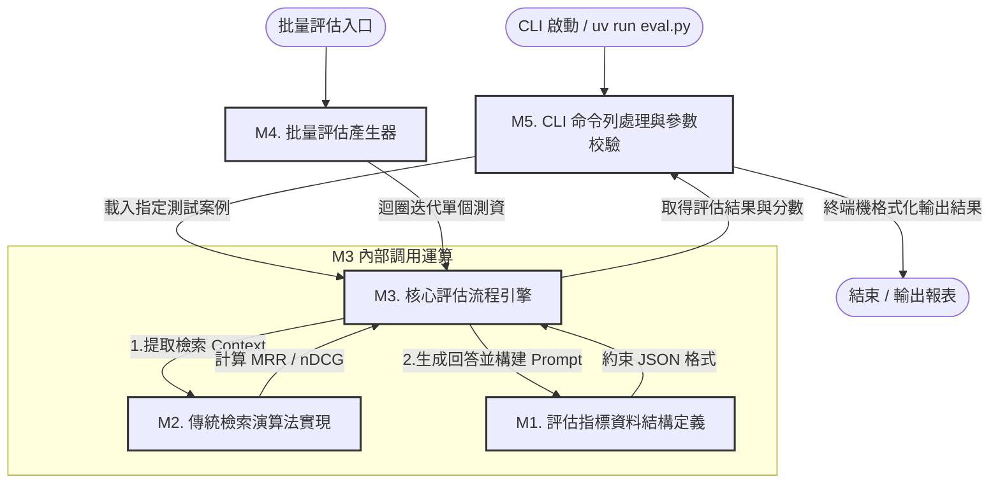

這是一份針對 `eval.py` 的全局分析大綱文件。本文件將嚴格按照您指定的結構梳理，作為我們後續逐模塊精讀的「座標系統」與引用基準。

## A. 整體定位

- **專案角色與外部依賴**：
    
    `eval.py` 在 RAG（檢索增強生成）系統中扮演「離線評估與品質把關（Evaluation Pipeline）」的角色。它依賴 Pydantic 進行結構化資料校驗、`litellm` 進行大模型裁判（LLM-as-a-judge）的調用、以及自定義的 `evaluation.test`（測試集載入）與 `utils.answer`（RAG 檢索與生成接口）。
    
- **小結**：
    
    它為 RAG 系統提供了**可量化的檢索指標（MRR/nDCG）**與**結構化的生成品質評估（LLM 裁判）**，解決了 RAG 系統在優化過程中「無法定量評估檢索好壞」與「人工盲測生成品質成本過高」的痛點。
    

## B. 模塊劃分與建議閱讀順序

整個腳本依語意可切分為以下 5 個主要模塊：

### M1. 評估指標資料結構定義 (Lines 13 - 37)

- **一句話概要**：利用 Pydantic 定義檢索評估（`RetrievalEval`）與 LLM 裁判評估（`AnswerEval`）的結構化欄位與評分標準。
    
- **預估閱讀難度**：入門 | **技術稀缺度**：一般 (基礎 AI 工程必備)
    
- **核心資料結構**：`RetrievalEval`、`AnswerEval` (繼承自 `BaseModel`)
    
- **關鍵知識點**：Pydantic Field 說明、Structured Outputs (結構化輸出) 提示詞工程。
    
- **工程實踐 / 效能瓶頸**：作為 `litellm` 的 `response_format`，其 Field description 會直接轉化為 JSON Schema 傳給大模型，定義的精確度直接影響 LLM 輸出 JSON 的成功率。
    

### M2. 傳統檢索指標演算法實現 (Lines 40 - 73)

- **一句話概要**：純數學與邏輯運算，實現資訊檢索領域經典的 MRR 與 nDCG（二元相關度）指標計算。
    
- **預估閱讀難度**：進階 | **技術稀缺度**：稀缺 (多數轉型工程師僅會呼叫 API，不懂底層資訊檢索指標)
    
- **核心資料結構**：Python `list` 與字串匹配
    
- **關鍵知識點**：倒數排名（Reciprocal Rank）、折扣累積增益（DCG）、理想折扣累積增益（iDCG）。
    
- **工程實踐 / 效能瓶頸**：當前使用 `keyword_lower in doc.page_content.lower()` 的粗暴子字串匹配，未考慮斷詞、同義詞，可能導致指標低估；在大量測資下，重複計算可能成為 CPU 密集型瓶頸。
    

### M3. 核心評估流程引擎 (Lines 76 - 156)

- **一句話概要**：封裝單次測試的「檢索評估（`evaluate_retrieval`）」與「生成評估（`evaluate_answer`）」核心邏輯。
    
- **預估閱讀難度**：進階 | **技術稀缺度**：中等 (RAG 核心開發者必備)
    
- **核心資料結構**：`TestQuestion`、JSON 格式 Prompt 字典。
    
- **關鍵知識點**：`fetch_context` 與 `answer_question` 的解耦調用、`litellm.completion` 配合 `response_format` 實現 LLM 裁判。
    
- **工程實踐 / 效能瓶頸**：`evaluate_answer` 內雖然註解寫了 async，但呼叫 `completion` 時並未加 `await`（為同步阻塞呼叫），且 LLM 裁判單次生成耗時長，此處為嚴重的網路 I/O 瓶頸。(目前先將原本的錯誤 docstrings、comments 改為 TODO，等待未來優化)
    

### M4. 批量評估產生器 (Lines 159 - 176)

- **一句話概要**：使用 Generator（產生器）機制，為上層提供可回傳進度的批量評估接口。
    
- **預估閱讀難度**：入門 | **技術稀缺度**：中等 (Python 進階語法)
    
- **核心資料結構**：`yield` 產生器元組 `(test, result, progress)`
    
- **關鍵知識點**：`yield` 關鍵字、串流式進度追蹤。
    
- **工程實踐 / 效能瓶頸**：代碼註解宣稱使用 "batched async execution"，但實際上依然是用 `for` 迴圈進行同步序列（Sequential）執行，若測試集有 100 題，耗時將會是單次 LLM 響應時間的 100 倍。(目前先將原本的錯誤 docstrings、comments 改為 TODO，等待未來優化)
    

### M5. CLI 命令列入口與格式化輸出 (Lines 179 - 225)

- **一句話概要**：處理終端機參數輸入，載入特定測試案例並格式化美化輸出結果。
    
- **預估閱讀難度**：入門 | **技術稀缺度**：一般
    
- **核心資料結構**：`sys.argv` 參數解析
    
- **關鍵知識點**：CLI 邊界條件處理、格式化浮點數輸出 (`:.4f`)。
    
- **工程實踐 / 效能瓶頸**：硬編碼了 `"tests.jsonl"`，降低了 CLI 切換測試集的靈活性。
    

### 建議精讀順序

資深工程師的實際拆解順序為：

$$\text{M5} \rightarrow \text{M3} \rightarrow \text{M1} \rightarrow \text{M2} \rightarrow \text{M4}$$

1. **M5 (CLI 入口)**：先看 `main` 與 `run_cli_evaluation`，掌握系統的調用起點與單次執行的生命週期。
    
2. **M3 (核心評估流程)**：順著 CLI 呼叫往下看，搞懂系統如何呼叫 RAG 並將資料餵給傳統演算法與 LLM 裁判，這是主幹線。
    
3. **M1 (資料結構定義)**：看完 M3 的主流程後，回頭審視 Pydantic 定義的欄位，理解 LLM 輸出的結構約束以及評估維度。
    
4. **M2 (傳統檢索演算法)**：進入底層核心演算法，精讀 MRR 與 nDCG 的數學公式與程式碼實現，確保評估指標的精確。
    
5. **M4 (批量評估產生器)**：最後看外圍的批量處理與未來的優化點（如真正實現非同步併發）。
    

## C. 全體流程圖 (巨觀地圖)

程式碼片段

- **函式呼叫關係說明**：
    
    本腳本之函式呼叫鏈為線性且層級淺（`main` $\rightarrow$ `run_cli_evaluation` $\rightarrow$ `evaluate_retrieval` / `evaluate_answer` $\rightarrow$ `calculate_mrr` / `calculate_ndcg`），無遞迴、無跨模塊多重呼叫，深度未達 3 層以上，故不另繪製複雜關係圖。
    

## D. 商業場景落地與工程價值

本架構（`eval.py`）的設計核心，是為了解決 RAG（檢索增強生成）系統在進入生產環境（Production）時，最棘手的「品質無法量化」**與**「迭代盲目」等企業級痛點。以下為本模塊的設計背景與核心技術亮點總結：

### 1. 真實場景痛點與解決方案

在真實的業務場景中，RAG 系統若缺乏自動化評估管線，通常會面臨以下挑戰：

- **優化方向全憑直覺**：工程師在調整 Chunk 大小、Top-$K$ 數量、或 Embedding 模型時，過去只能依賴人工「通靈式」肉眼盲測。本架構在 **M2 模塊引入資訊檢索指標（MRR、nDCG）**，提供客觀、定量的數據回饋，10 秒內即可得知檢索端調整的優劣。
    
- **人工評估成本高昂且主觀**：檢視大模型回答品質需要耗費大量人力與時間。本架構在 **M3 模塊設計了 LLM-as-a-judge（大模型裁判）機制**，並透過 **M1 模塊的 Pydantic 進行結構化 JSON 輸出約束**，實現多維度、自動化的生成品質打分，大幅降低回歸測試的成本。
    
- **解耦與進度追蹤需求**：在批量測試時，上層 UI 或 CLI 需要即時得知評估進度。本架構在 **M4 模塊利用 Generator（產生器）機制實現串流式進度追蹤**，完美解耦了底層評估邏輯與上層展示界面。
    

### 2. 核心技術亮點 (Key Highlights)

- **自動化評估管線（Evaluation Pipeline）建立**：整合 `LiteLLM` 與純數學邏輯運算，將學術界的經典檢索指標（MRR/nDCG）與工業界的 LLM 裁判技術結合，建構出端到端的 RAG 品質把關閉環。
    
- **嚴謹的數據合約與工程架構**：利用 Pydantic Structured Outputs 確保大模型裁判輸出的穩定性，避免 JSON 解析異常；並為後續的「非同步併發優化（Async/Batching）」預留了清晰的架構切分。