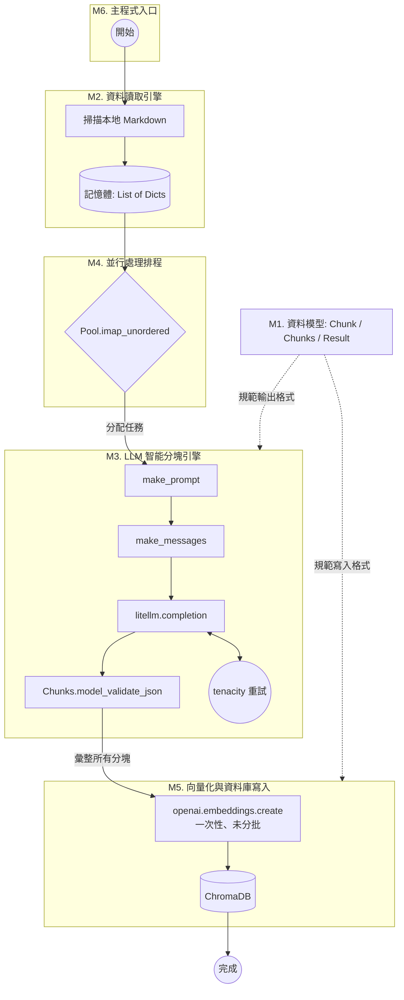
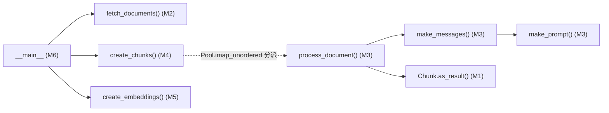

這是一份針對 `ingest.py` 的全局分析大綱。將以這份文件為基準，作為未來逐層精讀、探討細節的地圖。

## A. 整體定位

- **系統角色**：這是 Insurellm RAG 系統的 **ETL 資料管線**——Extract（讀取本地 Markdown）→ Transform（LLM 語意分塊）→ Load（向量化並寫入 ChromaDB）。它是離線的一次性/批次腳本，不在線上問答的請求路徑上，是為線上 RAG 查詢預先準備好知識庫。
- **外部依賴**：
    - `OpenAI`：計算 embedding 向量
    - `litellm.completion`：呼叫 LLM 做語意分塊（透過 `config.UTILITY_MODEL` 統一抽象化底層模型供應商）
    - `chromadb.PersistentClient`：本地向量資料庫
    - `pydantic`：定義並強制 LLM 的結構化輸出格式
    - `multiprocessing.Pool`：平行處理多份文件
    - `tenacity`：對 LLM 呼叫做指數退避重試
    - `tqdm`：進度條
    - `dotenv` + `config`：環境變數與專案設定
- **小結**：這個腳本存在的理由是——用 LLM 取代傳統機械式的字數/Token 分塊器，讓分塊結果具備語意完整性與可檢索的標題/摘要，同時用多進程與重試機制讓這件「很慢又容易 429」的事情能穩定跑完一整批文件。

---

## B. 模塊劃分與建議閱讀順序

### M1. 全局配置與資料模型

- **行號**：Line 1–46
- **一句話概要**：載入環境變數、初始化 `OpenAI` client，並用 Pydantic 定義資料流轉的標準規格（`Result`、`Chunk`、`Chunks`）。
- **閱讀難度 / 技術稀缺度**：入門 / 低
- **核心資料結構**：`Chunk`（強制 LLM 輸出 `headline` / `summary` / `original_text`）、`Chunk.as_result()` 負責把 LLM 輸出轉成 ChromaDB 要的 `page_content` + `metadata` 格式
- **工程實踐**：把「提示詞期望的輸出格式」物件化，是目前控制 LLM 輸出最穩定的主流做法（Structured Outputs）

### M2. 資料讀取引擎

- **行號**：Line 49–61
- **一句話概要**：遞迴掃描 `config.KNOWLEDGE_BASE_PATH` 下每個子資料夾（資料夾名即 `doc_type`），把 `.md` 檔案讀成記憶體中的字典列表。
- **閱讀難度 / 技術稀缺度**：入門 / 低
- **核心資料結構**：`List[dict]`，每筆含 `type` / `source` / `text`
- **工程實踐**：輕量版的 LangChain `DirectoryLoader`，去除臃腫依賴，但也代表沒有處理非 UTF-8 編碼、非 `.md` 格式的容錯。
- **效能瓶頸**：`rglob` + 逐檔 `open().read()` 是**同步、單執行緒、依序 I/O**——目前文件量小看不出問題，但若知識庫成長到數千份檔案，或檔案分布在網路磁碟/雲端掛載點上，單純的循序讀取會讓這一步的耗時線性增加，且完全沒利用到 I/O 等待期間的空檔。
- **已識別工程風險**：
    - 全部檔案內容一次性讀進記憶體（`documents` 列表持有所有文件的完整 `text`），文件量或單檔體積變大時有記憶體壓力，且必須等**全部**讀取完成才能進到 M4 的併發分塊，讀取階段本身沒有被平行化。
    - 未來若要優化，可考慮用 `concurrent.futures.ThreadPoolExecutor` 做 multi-thread 讀取（此步驟是 I/O bound，thread 已足夠，不需要動用到 process），或改成 generator/streaming 方式讓 M4 邊讀邊分塊，而不是等 M2 全部跑完才開始。
    - 沒有檔案級別的例外處理（例如編碼錯誤、檔案被鎖定）：單一檔案讀取失敗會讓整個 `fetch_documents()` 中斷，而不是跳過該檔、記錄警告後繼續。

### M3. LLM 智能分塊引擎

- **行號**：Line 64–101 _（v1 誤標為 64–113，與 M4 重疊；v2 修正）_
- **一句話概要**：動態估算預期分塊數 → 組裝 Prompt → 呼叫 LLM → 用 `Chunks.model_validate_json` 校驗並轉成 `Result` 列表。
- **閱讀難度 / 技術稀缺度**：進階 / 中高（Prompt Engineering + Pydantic Structured Output 結合，是目前 AI engineer 職缺很看重的實戰能力）
- **核心資料結構**：動態 Prompt 模板（`make_prompt`）、`Chunks` → `List[Result]`
- **關鍵知識點**：LLM Structured Output、`tenacity` 指數退避重試（`@retry(wait=wait_exponential(...))`）
- **效能瓶頸**：整支腳本最慢、最容易 Timeout / Rate Limit (HTTP 429) 的地方
- **已識別工程風險**：`openai = OpenAI()` 與 `wait = wait_exponential(...)` 都是在 **模組載入時（M1）於主行程建立的全域物件**，之後才被 `Pool` fork 到子行程使用。若底層 HTTP client 持有非跨行程安全的連線池/socket，在 fork 之後直接沿用可能導致連線異常；這點在精讀 M3+M4 交界處時值得專門確認。

### M4. 並行處理排程

- **行號**：Line 104–113 
- **一句話概要**：用 `multiprocessing.Pool` 搭配 `imap_unordered` 把 M3 的 `process_document` 併發套用到所有文件上，先完成的先回傳。
- **閱讀難度 / 技術稀缺度**：進階 / 中
- **核心資料結構**：`Pool`、`tqdm` 進度條
- **工程實踐**：`imap_unordered` 最大化吞吐量，不卡在原始順序上；docstring 也提示了「若遇到 rate limit 就把 `INGEST_WORKERS` 調成 1」——這其實暗示了團隊已經在生產中撞過這個問題。
- **已識別工程風險**：`multiprocessing.Pool` 預設用 fork（Linux）或 spawn（macOS/Windows）建立子行程；若未來把 `litellm.completion` 換成 async 版本 API，`multiprocessing` 與 `asyncio` 事件迴圈無法直接混用，需要改用 `ProcessPoolExecutor` + 每個子行程各自建立事件迴圈，或改用純 async 併發（`asyncio.gather` + 限流），而不是 process pool。

### M5. 向量化與資料庫寫入

- **行號**：Line 116–131
- **一句話概要**：先刪除同名舊 collection（確保乾淨），一次性把所有 chunk 的文字送 OpenAI 算 embedding，再連同 metadata 寫入 ChromaDB。
- **閱讀難度 / 技術稀缺度**：進階 / 中
- **關鍵知識點**：向量資料庫 CRUD（先刪後建）、批次計算 Embeddings
- **已識別工程風險**：`openai.embeddings.create(model=..., input=texts)` 把**全部** chunk 的文字一次性塞進單一請求，沒有依 batch size 拆分。當文件量大、chunk 數達到數千筆時，可能超出 embedding API 單次請求的筆數/token 上限而整批失敗，且目前沒有對這個呼叫做重試（`@retry` 只包在 M3 的 `process_document` 上，M5 沒有）。這是目前管線裡最脆弱、也最值得優先補強的一段。

### M6. 主程式入口

- **行號**：Line 134–138
- **一句話概要**：定義最高層 ETL 流程：`fetch_documents()` → `create_chunks()` → `create_embeddings()`。

---

### 建議精讀順序

|順序|模塊|理由|
|---|---|---|
|1|**M6** 主程式入口|先抓主線任務：一眼看出全腳本只做三件事——抓檔、分塊、存向量庫，建立心智地圖後再往下鑽。|
|2|**M2** 資料讀取引擎|先看「進來的原始資料長什麼樣」（Raw Data），這是後續所有轉換的輸入基準。|
|3|**M1** 資料模型|再看「最終預期輸出長什麼樣」（Structured Data）。掌握輸入與輸出兩端後，中間的轉換邏輯會更容易推測。|
|4|**M4** 並行處理排程|在深入演算法細節前，先搞懂架構層的調度方式（Map-Reduce 概念：多份文件 → `process_document` 併發執行），避免之後讀 M3 時被「這函式到底被誰、怎麼呼叫」打斷思路。|
|5|**M3** LLM 智能分塊引擎|全代碼的精華，也是唯一需要「進階」理解力的模塊：Prompt 怎麼寫、Pydantic 怎麼接、Rate Limit 怎麼防。放在架構搞懂之後讀，才知道它是被誰、以什麼頻率呼叫。|
|6|**M5** 向量化與資料庫寫入|收尾模塊，確認資料落地的最終型態與 ChromaDB API 用法；也是目前風險最集中的地方，適合放在最後、帶著前面的全局理解來檢視。|

---

## C. 整體流程圖（巨觀地圖）

> **函式呼叫圖**
> 
> `create_chunks (M4)` → `process_document (M3)` → `make_messages (M3)` → `make_prompt (M3)`
> 
> 從 `__main__` 算起，這是一條深度達 5 層的呼叫鏈（`Main → create_chunks → process_document → make_messages → make_prompt`）：

---

## D. 商業場景落地與工程價值

本架構（`ingest.py`）的設計核心，是為了克服傳統 RAG 系統在資料準備階段（Data Ingestion）最常見的「機械式切分導致上下文斷裂」與「海量文本處理效率低落」等企業級痛點。以下為本模塊的設計背景與核心技術亮點總結：

### 1. 真實場景痛點與解決方案

在處理企業內部複雜的文件（如保險條款、技術規格書）時，傳統的 Ingestion Pipeline 通常會面臨以下挑戰：

- **字數死板切分導致資訊碎片化**：傳統基於 Token 或字數的切分器（如 `RecursiveCharacterTextSplitter`）容易將同一個核心概念硬生生切斷，且檢索出來的文字塊常缺乏前後文。本架構在 **M3 模塊實現了 LLM 智能分塊引擎**，利用大模型進行語意級分塊，並透過 **M1 模塊定義的 Pydantic 規格**，強制為每個區塊提取出「情境標題（headline）」與「重點摘要（summary）」，大幅提升了後續向量檢索的精準度。
- **海量文件處理的效能瓶頸**：若採用單執行緒依序呼叫 LLM API，面對數千份文件時耗時極長。本架構在 **M4 模塊引入 Python 內建的多進程池（`multiprocessing.Pool`）與 `imap_unordered` 排程**，將文本轉換任務並行化，最大化系統吞吐量並顯著縮短 bulk-processing 時間。
- **高併發下的 API 限流與不穩定性**：多進程併發呼叫外部大模型 API 時，極易觸發 Rate Limit (HTTP 429) 或遭遇網路波動。本架構在 **M3 模塊整合 `Tenacity` 的指數退避重試機制（Exponential Backoff）**，建立起具備自癒能力的彈性資料管線，確保大規模資料寫入時的魯棒性（Robustness）。

### 2. 核心技術亮點 (Key Highlights)

- **語意級 Agentic ETL 管線設計**：跳脫傳統非結構化資料處理的框架，將 LLM 結構化輸出（Structured Outputs）技術引入 ETL 的 Transform 階段，讓資料在落地進入向量庫（ChromaDB）前就具備高質量的 Metadata 標記。
- **高可用性與高效能調度**：融合了 Python 多進程並行控制與分散式系統常見的彈性容錯重試機制，實現了高吞吐量、低失敗率且去中心化依賴（解耦臃腫框架）的輕量級企業級知識庫導入方案。
- **具備風險意識的架構審查**：在 M2、M4、M5 的精讀過程中，進一步識別出讀取階段未平行化、跨行程共享全域 client、embedding 呼叫未分批等潛在風險點，為下一階段的穩健性優化（Batching、非同步 I/O）提供了明確的改善方向，展現對生產級系統可靠性的全面考量。