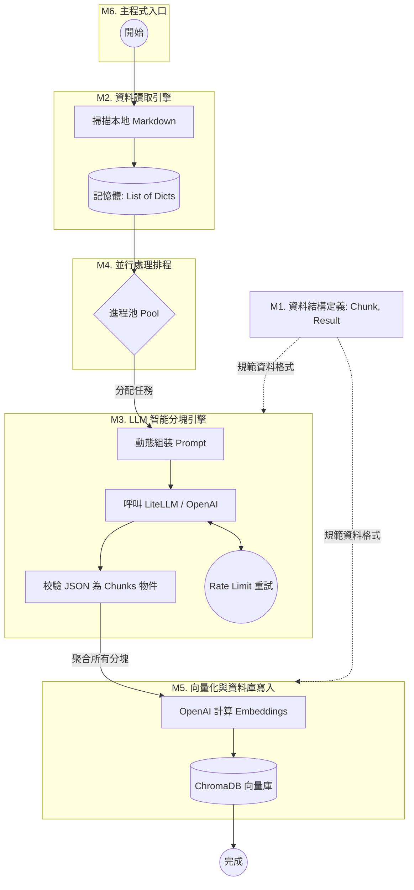
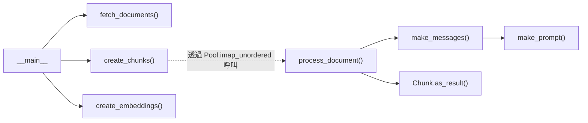

這是一份為你量身打造的 `ingest.py` 全局分析大綱。我們將以這份文件為基準，作為未來逐層精讀、探討細節的地圖。

## A. 整體定位

- **系統角色與依賴**：這個腳本是 Retrieval-Augmented Generation (RAG) 系統中的**核心資料管線 (ETL Pipeline)**。它負責提取 (Extract) 本地文件、利用 LLM 轉換/分塊 (Transform)、並將向量化結果載入 (Load) 到向量資料庫中。
    
    - **外部依賴**：`OpenAI` / `LiteLLM` (模型呼叫與分塊邏輯)、`ChromaDB` (向量儲存)、`Pydantic` (資料結構校驗與 LLM 結構化輸出)、`multiprocessing` (並行加速)、`Tenacity` (API 錯誤重試機制)。
        
- **小結**：它解決了傳統 RAG「機械式字數分塊導致上下文斷裂」的痛點，透過呼叫 LLM 對文件進行**語意級別的智能分塊與摘要**，並透過多進程處理與重試機制將這些高質量文本安全地寫入 Chroma 向量資料庫。
    

## B. 模塊劃分與建議閱讀順序

我們將整份代碼劃分為以下 6 個語意模塊 (M1~M6)：

### 模塊詳解

- **M1. 全局配置與資料模型 (Global Config & Data Models)**
    
    - **行號**：Line 1 - 46
        
    - **一句話概要**：載入環境變數、初始化外部套件，並透過 Pydantic 定義資料流轉的標準規格 (`Result`, `Chunk`, `Chunks`)。
        
    - **閱讀難度 / 技術稀缺度**：入門 / 低
        
    - **核心資料結構**：`Chunk` 類別 (強制 LLM 輸出 `headline`, `summary`, `original_text`)
        
    - **工程實踐**：將提示詞期望的輸出格式「物件化」，這是目前控制 LLM 輸出最穩定的主流作法 (Structured Outputs)。
        
- **M2. 資料讀取引擎 (Data Extraction)**
    
    - **行號**：Line 49 - 61
        
    - **一句話概要**：遞迴掃描指定目錄下的 Markdown 檔案，將實體檔案轉換為記憶體中的字典列表。
        
    - **閱讀難度 / 技術稀缺度**：入門 / 低
        
    - **核心資料結構**：`List[dict]` (包含 type, source, text)
        
    - **工程實踐**：這是一個輕量級的 LangChain `DirectoryLoader` 替代品，去除了臃腫的依賴。
        
- **M3. LLM 智能分塊引擎 (LLM-based Intelligent Chunking Engine)**
    
    - **行號**：Line 64 - 113
        
    - **一句話概要**：動態計算預期分塊數，構建 Prompt，並呼叫 LLM 將長文本解析為包含標題與摘要的結構化區塊。
        
    - **閱讀難度 / 技術稀缺度**：進階 / 中高 (精通 Prompt Engineering 與 Pydantic 結合的工程師很搶手)
        
    - **核心資料結構**：動態 Prompt 模板、被轉換為 `Result` 物件的列表。
        
    - **關鍵知識點**：LLM 結構化輸出 (JSON mode/Tool calling)、指數退避演算法 (Exponential Backoff, `@retry`)。
        
    - **效能瓶頸**：這裡是整個腳本最慢、最容易發生 Timeout 或 Rate Limit (HTTP 429) 的地方。
        
- **M4. 並行處理排程 (Parallel Processing Orchestration)**
    
    - **行號**：Line 104 - 113
        
    - **一句話概要**：利用 Python 內建的多進程池 (`multiprocessing.Pool`)，將 M3 的處理邏輯併發應用到所有文件上。
        
    - **閱讀難度 / 技術稀缺度**：進階 / 中
        
    - **核心資料結構**：進程池 (`Pool`)、進度條 (`tqdm`)
        
    - **工程實踐**：使用 `imap_unordered` 最大化吞吐量，先處理完的任務先回傳，不卡在原本的順序上。
        
- **M5. 向量化與資料庫寫入 (Embedding & Vector DB Storage)**
    
    - **行號**：Line 116 - 131
        
    - **一句話概要**：將分塊好的文本送入 OpenAI 計算 Embedding 向量，並連同 metadata 儲存到本地的 ChromaDB 實體中。
        
    - **閱讀難度 / 技術稀缺度**：進階 / 中
        
    - **關鍵知識點**：向量資料庫 CRUD (先刪後建以確保資料乾淨)、批次計算 Embeddings。
        
- **M6. 主程式入口 (Main Orchestrator)**
    
    - **行號**：Line 134 - 138
        
    - **一句話概要**：腳本的進入點，定義了最高層級的 ETL 流程 (Extract -> Transform -> Load)。
        
    - **閱讀難度 / 技術稀缺度**：入門 / 低
        

### 建議精讀順序

資深工程師的閱讀路徑通常是「從巨觀到微觀、從資料來源到核心演算法」：

1. **M6 (主程式入口)**：抓出主線任務。一眼看出腳本只做三件事：抓檔、分塊、存入向量庫。
    
2. **M2 (資料讀取)**：看看進來的原始資料長什麼樣子 (Raw Data)。
    
3. **M1 (資料模型)**：看看最終預期輸出的資料長什麼樣子 (Structured Data)。掌握了輸入和輸出，就能推測中間的轉換。
    
4. **M4 (並行處理)**：了解架構層面如何調度任務 (Map-Reduce 概念)。
    
5. **M3 (智能分塊)**：**全代碼的精華**。深入研究 LLM Prompt 怎麼寫、Pydantic 怎麼接、Rate Limit 怎麼防。
    
6. **M5 (向量化寫入)**：收尾，確認資料落地的最終型態與 ChromaDB 的 API 用法。
    

## C. 整體流程圖 (巨觀地圖)

以下是這份 ETL 腳本的資料流向與模塊調度圖：

程式碼片段

> **補充：呼叫關係深度說明**
> 
> 這裡存在一條深度達 4 層的呼叫鏈：`M4.create_chunks` (排程) 呼叫 `M3.process_document` (處理)，後者再呼叫 `M3.make_messages` (封裝訊息)，最底層呼叫 `M3.make_prompt` (生成 Prompt)。在後續精讀 M3 時，我們會針對這段進行內部邏輯拆解。

(額外補充函式呼叫關係圖 (Call Graph)，這是 ver1. 需要檢查)

## D. 商業場景落地與工程價值

本架構（`ingest.py`）的設計核心，是為了克服傳統 RAG 系統在資料準備階段（Data Ingestion）最常見的「機械式切分導致上下文斷裂」**與**「海量文本處理效率低落」等企業級痛點。以下為本模塊的設計背景與核心技術亮點總結：

### 1. 真實場景痛點與解決方案

在處理企業內部複雜的文件（如保險條款、技術規格書）時，傳統的 Ingestion Pipeline 通常會面臨以下挑戰：

- **字數死板切分導致資訊碎片化**：傳統基於 Token 或字數的切分器（如 `RecursiveCharacterTextSplitter`）容易將同一個核心概念硬生生切斷，且檢索出來的文字塊常缺乏前後文。本架構在 **M3 模塊實現了 LLM 智能分塊引擎**，利用大模型進行語意級分塊，並透過 **M1 模塊定義的 Pydantic 規格**，強制為每個區塊提取出「情境標題（headline）」與「重點摘要（summary）」，大幅提升了後續向量檢索的精準度。
    
- **海量文件處理的效能瓶頸**：若採用單執行緒依序呼叫 LLM API，面對數千份文件時耗時極長。本架構在 **M4 模塊引入 Python 內建的多進程池（`multiprocessing.Pool`）與 `imap_unordered` 排程**，將文本轉換任務並行化，最大化系統吞吐量並顯著縮短 bulk-processing 時間。
    
- **高併發下的 API 限流與不穩定性**：多進程併發呼叫外部大模型 API 時，極易觸發 Rate Limit (HTTP 429) 或遭遇網路波動。本架構在 **M3 模塊整合 `Tenacity` 的指數退避重試機制（Exponential Backoff）**，建立起具備自癒能力的彈性資料管線，確保大規模資料寫入時的魯棒性（Robustness）。
    

### 2. 核心技術亮點 (Key Highlights)

- **語意級 Agentic ETL 管線設計**：跳脫傳統非結構化資料處理的框架，將 LLM 結構化輸出（Structured Outputs）技術引入 ETL 的 Transform 階段，讓資料在落地進入向量庫（ChromaDB）前就具備高質量的 Metadata 標記。
    
- **高可用性與高效能調度**：融合了 Python 多進程並行控制與分散式系統常見的彈性容錯重試機制，實現了高吞吐量、低失敗率且去中心化依賴（解耦臃腫框架）的輕量級企業級知識庫導入方案。